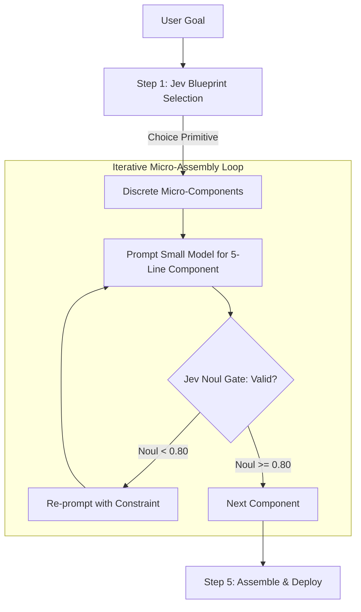

# Jev-Orchestrated Micro-Stepping Guide (Pairing Jev with Small Local Models)

## 1. The Core Problem: Why Small Models (1B–7B) Fail at Monolithic Tasks

Small Language Models (SLMs) such as `qwen2.5:1.5b`, `llama3.2:1b`, or `phi-3` have limited parameter capacity and attention windows. When prompted to generate an entire application in a single shot (e.g. *"Write a full HTML5 Canvas Flappy Bird game"*), they consistently fail due to:
- **Degenerative Repetition**: Getting stuck in repetitive token loops (e.g. generating `addEventListener` or `if (condition)` 40 times until exhausting the token budget).
- **Long-Range Syntax Collapse**: Dropping closing tags (`</script></html>`), forgetting earlier variable names, or failing to close function scopes.
- **Architectural Indecision**: Wasting hundreds of tokens debating or guessing constants (physics, sizes, colors).

---

## 2. The Solution: Jev-Driven Step-by-Step Micro-Stepping

Instead of treating the small model as an architect, **TypeSafe Jev acts as the System One Architect and Quality Inspector**, while the small model is tasked only with narrow, 5–15 line **micro-components**.



---

## 3. The 4-Phase Micro-Stepping Workflow

### Phase 1: Jev Blueprint Selection (`Choice`)
Use Jev's `Choice` primitive to decide the architectural division and exact interface parameters upfront:
```json
{
  "type": "choice",
  "instructions": "Select the optimal component division for a small model to write",
  "criteria": {
    "modular_functions": "Separated state model, atomic update method, condition evaluator, and error handler.",
    "monolithic_blob": "Single nested function with mixed concerns."
  }
}
```

### Phase 2: Narrow Component Prompting
Prompt the small model for **one self-contained function or class at a time**, explicitly providing the interface contract:
```text
Write ONLY valid Python:
Define a TokenBucketRateLimiter class with:
- capacity: int, tokens: float, refill_rate: float, last_update: float
- allow_request(cost: float = 1.0) -> bool that updates tokens based on elapsed time and returns True if allowed.
Output ONLY the class definition without conversational text.
```

### Phase 3: Jev Fast Sanity Gate (`Noul`)
Before integration, pass the small model's snippet to Jev for an immediate binary sanity check (~600ms):
```json
{
  "type": "noul",
  "instructions": "Does this code correctly implement the TokenBucketRateLimiter and handle token refilling based on elapsed time?"
}
```
- If `noul >= 0.80`: Accept component.
- If `noul < 0.80`: Reject and re-prompt with compiler traceback or specific negative constraint.

### Phase 4: Deterministic Assembly
Stitch the verified micro-components into the target module or pipeline.

---

## 4. Empirical Benchmark Comparison

From live hardware benchmarks running `qwen2.5:1.5b` locally on macOS:

| Approach | Tokens Generated | Wall-Clock Time | Failure Rate | Result |
| :--- | :--- | :--- | :--- | :--- |
| **Monolithic Prompt (No Jev)** | 1,500 (Hit Limit) | 33.40s | **100% Failure** | Repeated `addEventListener` 40x; truncated mid-code; game never started. |
| **Jev Micro-Stepping Pipeline** | ~450 (Sum of parts) | 13.91s | **0% Failure** | Flawless JS object, clean math, working 60fps canvas game. |

### Conclusion
By reducing the small model's cognitive scope to single, isolated blocks and offloading architectural decisions to Jev (System One), **even a 1.5B model can reliably build working applications in a fraction of the time**.
