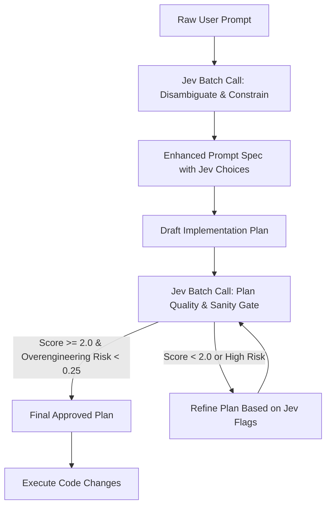

# Jev-Constrained Prompt Enhancement & Implementation Planning Guide

## 1. The Core Insight: Front-Loading Quality to the Planning Phase

Most agent failures happen **before a single line of code is written**:
- The prompt is underspecified or ambiguous.
- The agent makes wrong assumptions about architecture, dependencies, or scope.
- The implementation plan is either overengineered or ignores critical edge cases.

By inserting **TypeSafe Jev (System One)** at the **Prompt Enhancement** and **Implementation Planning** stages, we turn fuzzy natural language into calibrated, structured engineering constraints in a single ~700ms batch call.

---

## 2. Batch Questioning (Speculative Fan-Out in a Single HTTP Call)

In TypeSafe AI, **all questions over the same state should be batched together in a single request**:
- **Zero Added Latency**: Jev evaluates 10 questions in parallel in virtually the same time as 1 question (~700ms).
- **Massive Token Efficiency**: The `state` (prompt, codebase context, or plan) is processed once instead of re-uploaded N times.

### The Batched Enhancement Request Schema
```json
{
  "state": "## User Prompt\nCreate a 3D horse racing game in browser with real physics and authentic rules.",
  "model": "jev-latest",
  "questions": {
    "engine_choice": {
      "type": "choice",
      "instructions": "Select the optimal 3D engine for standard browser performance",
      "criteria": {
        "threejs": "Three.js: universal WebGL compatibility, rich primitives, lightweight.",
        "babylon": "Babylon.js: heavier engine, advanced built-in physics.",
        "raw_webgl": "Raw WebGL: maximum control, but excessive boilerplate."
      }
    },
    "complexity_scope": {
      "type": "choice",
      "instructions": "Select the appropriate scope boundary for the initial deliverable",
      "criteria": {
        "focused_playable_vertical_slice": "Complete single track, core physics, responsive controls, win condition.",
        "full_monolith": "Multiplayer, career mode, weather system, full tournament bracket."
      }
    },
    "needs_external_assets": {
      "type": "noul",
      "instructions": "Does this task require external 3D models/textures, or can it be built with procedural Three.js geometries to eliminate broken asset dependencies?"
    },
    "overengineering_risk": {
      "type": "noul",
      "instructions": "Is there high risk of introducing unnecessary build tools (Vite/Webpack) when a self-contained single file suffices?"
    }
  }
}
```

---

## 3. Workflow: Prompt Enhancement + Implementation Plan Gating



---

## 4. Phase 1: Jev Prompt Enhancement

Before generating an implementation plan or writing code, pass the raw prompt into Jev to resolve ambiguities:

### Questions to Batch in Prompt Enhancement:
1. **`target_architecture` (`Choice`)**: Determines the stack, modularity pattern, and state management approach.
2. **`scope_boundary` (`Choice`)**: Locks the deliverable to a clean MVP vertical slice instead of sprawling unfinished scope.
3. **`dependency_strategy` (`Choice`)**: Chooses between zero-dependency standard library/CDN vs npm packages.
4. **`has_breaking_change_risk` (`Noul`)**: Checks if the requested change might break existing public contracts.

The answers become concrete constraints injected into the task specification.

---

## 5. Phase 2: Implementation Plan Gating

Before presenting an `implementation_plan.md` to the user or proceeding to execution, feed the draft plan into Jev:

### Questions to Batch in Plan Gating:
1. **`plan_maintainability` (`Score`)**:
   - `0`: Tangled, missing file demarcations, vague verification.
   - `1`: Plausible but has hidden assumptions or missing step sequences.
   - `2`: Modular, step-by-step, explicit dependencies and verification steps.
   - `3`: Production excellence, backwards-compatible, self-verifying.
2. **`is_overengineered` (`Noul`)**:
   - Probability that the plan introduces premature abstractions, unnecessary configuration files, or gratuitous frameworks.
   - Threshold: **Reject if `noul > 0.30`**.
3. **`verifiability` (`Noul`)**:
   - Probability that the proposed verification plan has concrete, automated test commands rather than vague manual checks.
   - Threshold: **Reject if `noul < 0.75`**.

---

## 6. Real-World Benefit

- **Zero Hallucinated Scopes**: The agent stops guessing what the user wants.
- **Immediate Architectural Alignment**: Jev selects the right constants and libraries in 700ms.
- **Elimination of Overengineering**: Jev's `is_overengineered` Noul check stops the agent from installing heavy frameworks when simple vanilla solutions are superior.
