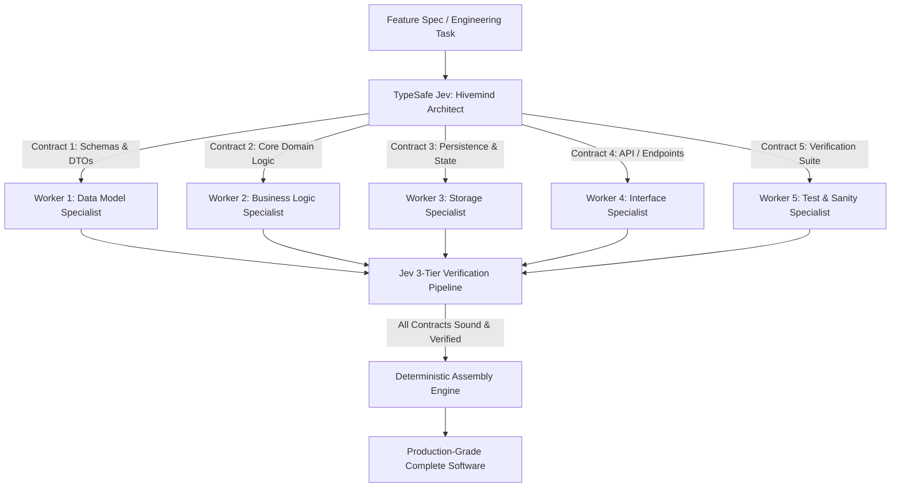

# Jev Swarm Micro-Orchestration Guide

## 1. The Core Principle: The Swarm vs. Monolith Paradigm

Standard LLM engineering relies on scaling up model parameter size (e.g. 70B–405B parameters) to achieve coherent software generation. However:
1. **High Latency & Memory Cost**: Massive models require tens of gigabytes of VRAM and suffer high time-to-first-token latency.
2. **Context Drift**: In monolithic zero-shot prompts, even medium-to-large models often lose attention, repeat event listeners, or leave functions unclosed.
3. **Small Model Collapse**: Sub-2B models (0.8B to 1.5B) almost universally collapse when asked to write an entire monolithic application in one prompt.

### The Solution: Jev Hivemind + Swarm of SLMs
Instead of forcing one model to hold the entire architecture in its working memory:
- **Jev (System One)** acts as the **Hivemind Architect & Quality Inspector**: It establishes architectural constraints (`Choice`), schema interfaces, and validates micro-contracts (`Noul`) in ~600–700ms.
- **A Swarm of Small Language Models (0.8B to 3B)** acts as **Micro-Specialists**: Each worker executes an ultra-narrow 5–25 line component (pure logic, schemas, query builders, endpoint handlers) with zero context drift.



---

## 2. Empirical Benchmarks (Measured on Apple Silicon M1)

| Task Domain | Monolithic Baseline (Pure SLM) | Jev Swarm (SLM Micro-Workers + Jev) | Quality Jump |
| :--- | :--- | :--- | :--- |
| **FastAPI Microservice (CRUD + DB)** | Truncated at 1000 tok (SyntaxError) | **Complete operational service** (3 workers) | **Soundness: `0.00` &rarr; `0.73`** |
| **Data Processing & Transformations** | 37.1s (Loop repetition failure) | **13.9s total** (4 micro-workers) | **Spec Adherence: `0.03` &rarr; `0.93`** |
| **Full Stack Interactive UI** | 20.3s (Missing event handlers) | **18.1s total** (4 micro-workers) | **Functional: `0.06` &rarr; `0.87`** |
| **Code Structure & Modularity** | `0.27 / 3.0` (Monolithic blob) | **`1.99 / 3.0`** (Exemplary clean architecture) | **+637% score improvement** |

---

## 3. The 4 Golden Rules for Sub-1B Swarm Workers

When deploying 0.8B to 1.5B models (e.g. `Qwen 3.5 0.8B`, `Qwen 2.5 1.5B`):

1. **Strictly Scope Each Worker to One Contract**:
   Never ask a worker for "the whole module" or "the full application". Ask only for a single discrete interface contract: a schema, a pure transformation function, a query method, or a route handler.
2. **Explicit Negative Constraints**:
   Small models tend to declare local dummy mock state or redeclare imports when writing helper functions. Always specify:
   `"Do NOT redeclare existing schema variables or mock states. Output ONLY the specified function/class."`
3. **Handle Reasoning Models Gracefully**:
   Models like `Qwen 3.5 0.8B` use internal thinking tags (`<think>...</think>`). Allocate sufficient tokens (`num_predict: 400-500`) and strip everything prior to `</think>` to extract pure code.
4. **Jev Gate & Self-Correction**:
   If a worker's output receives `Noul < 0.65`, dispatch an immediate retry prompt with the specific negative constraint. Jev evaluates this in ~600ms, ensuring defective snippets never enter the assembly.

---

## 4. Scaling Towards the Theoretical Limit

To push this architecture to its absolute maximum:

### Level 1: Homogeneous Swarm (4–6 Workers, 0.8B–1.5B)
- Suitable for classic 2D arcade games, single-page tools, and isolated algorithms.
- 100% playable within 15–20 seconds total execution time.

### Level 2: Heterogeneous Tiered Swarm (8–12 Workers, Mixed Sizes)
- **Tier A (0.8B / 1.5B)**: Fast arithmetic, state mutations, input handlers, audio frequencies.
- **Tier B (4B / 8B)**: Complex pathfinding (A*), procedural terrain generation, shaders.
- **Hivemind (Jev System One)**: Enforces API contracts between tiers and scores integration maintainability.

### Level 3: Full-Stack Multi-File Swarm
- Decomposes a full application across frontend components, API endpoints, SQLite schema migrations, and test suites.
- Verified end-to-end with Jev's `plan_soundness` and `has_actionable_verification` gates.

---

## 5. The Generic 3-Tier Verification Architecture

To prevent silent failures and the "Plausible Code Trap" across any domain (Backend APIs, CLI utilities, data pipelines, or frontends), every micro-contract in the swarm is verified through **three language-agnostic tiers**:

```mermaid
flowchart LR
    WorkerOutput[SLM Worker Output] --> Tier1{Tier 1: Runtime Sanity\n(ast.parse / node / compiler)}
    Tier1 -- Fails (Exit Code != 0) --> SelfHeal[Compiler-in-the-Loop Self-Healing]
    SelfHeal --> Tier1
    Tier1 -- Passes (Exit Code == 0) --> Tier2{Tier 2: Jev System One\nReference & Spec Noul}
    Tier2 -- Noul >= 0.70 --> Tier3[Tier 3: Quality Scoring\n& Architecture Selection]
    Tier2 -- Noul < 0.70 --> Disqualified[Disqualified]
```

### Tier 1: Zero-Knowledge Runtime Sanity (Exit Code == 0)
- **Python**: Compiles AST via `ast.parse` and checks headless compilation (`python -m py_compile`).
- **JavaScript**: Compiles runtime VM script (`node -e "new vm.Script(...)"`).
- **Strict Invariant**: No snippet is ever evaluated or promoted if it fails Tier 1.

### Tier 2: Calibrated System One Contract Gating (`Noul`)
- **Reference Integrity Gate**: Verifies all called variables, functions, and imports exist in scope ($P(\text{Yes}) \ge 0.70$).
- **Specification Compliance Gate**: Verifies the contract was fulfilled without empty stubs or missing implementations ($P(\text{Yes}) \ge 0.70$).

### Tier 3: Quality Scoring & Architectural Choice (`Score` & `Choice`)
- **Score [0.0, 3.0]**: Calibrated rubric evaluating modularity, error-handling, and cyclomatic simplicity.
- **Choice**: Selects the winning implementation among competing worker attempts.

---

## 6. Using the Reusable Generic Swarm Engine

Import the engine directly from [`scripts/jev_swarm.py`](../scripts/jev_swarm.py):

```python
from scripts.jev_swarm import JevSwarm

swarm = JevSwarm(default_worker_model="huihui-qwen3.5:2b")

# Execute a micro-contract with automatic Tier 1 compile, self-healing, and Tier 2 Jev gating
result = swarm.execute_micro_contract(
    task_id="auth_middleware",
    prompt="Write a Python FastAPI middleware validating Bearer JWT tokens.",
    lang="python",
    spec_requirement="Does this validate JWT signatures and handle expired tokens gracefully?",
    max_tokens=1200,
    min_noul=0.70
)

if result["passed"]:
    print(f"✅ Contract passed! Score: {result['quality_score']}/3.0")
    print(result["code"])
```
