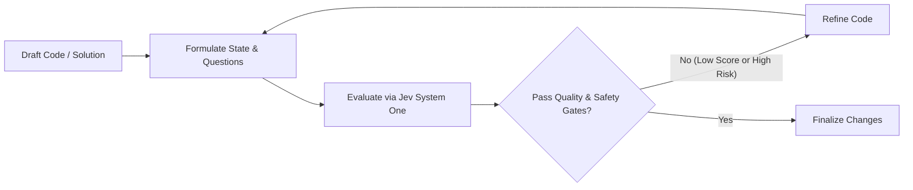

# TypeSafe AI (Jev) Code Intelligence & Evaluation Skill

This skill teaches the coding agent how to leverage [TypeSafe AI](https://docs.typesafe.ai/introduction) and its flagship **System One model (Jev)** to elevate code quality, verify solutions against specifications, and build robust software integrations.

---

## 1. Mental Model: System One for Software Engineering

Unlike standard LLMs that generate freeform conversational text, **Jev** is a **System One** model trained to make **fast, calibrated, and structured decisions**.

- **Input**: Natural language context and state (code, diffs, user requirements, schemas).
- **Questions**: Typed queries evaluated in parallel.
- **Output**: Typed choices, continuous scores, and calibrated probabilities (not unverified prose).

### The Three Primitives

| Primitive | Software Engineering Application | Result Type |
| :--- | :--- | :--- |
| **`Choice`** | Selecting between competing architectural patterns, algorithms, or refactoring strategies. | Selected option, distribution over choices, confidence. |
| **`Score`** | Evaluating code maintainability, test thoroughness, security posture, or simplicity. | Continuous score along descriptive rubric levels, confidence. |
| **`Noul`** | Binary sanity check: regression risk, spec adherence, edge-case safety, security holes. | Calibrated probability $P(\text{Yes}) \in [0.0, 1.0]$. |

---

## 2. Core Workflow: How to Improve Code with Jev

Whenever implementing non-trivial code changes, refactoring, or designing architecture, follow this iterative loop:



### Step 1: Formulate State
Structure the state into clear sections:
1. **Requirements**: The user request and acceptance criteria.
2. **Context**: Relevant files, dependencies, constraints.
3. **Proposed Code**: The draft snippet or git diff.

### Step 2: Fan Out Speculative Questions in One Request
Batch multiple questions into a single call to save latency and token budget:
- A `score` on maintainability.
- A `noul` on `satisfies_spec`.
- A `noul` on `has_regression_risk`.
- A `choice` on design alternatives (if evaluating options).

### Step 3: Run the Evaluation CLI
Use the bundled helper script [jev_eval.py](./scripts/jev_eval.py):

```bash
# Evaluate a file against requirements
./scripts/jev_eval.py --file src/worker.py --prompt "Implement async worker pool with max 5 concurrency"

# Evaluate a git diff
git diff > /tmp/patch.diff
./scripts/jev_eval.py --diff /tmp/patch.diff --prompt "Fix user session timeout bug"

# Security audit mode
./scripts/jev_eval.py --file src/auth.py --mode security
```

*(Requires `TYPESAFE_API_KEY` set in the environment or `--api-key`).*

### Step 4: Interpret the Output & Iterate
- **Maintainability `< 2.0`**: Refactor for cleaner naming, lower cognitive complexity, or better separation of concerns.
- **`has_regression_risk > 0.20`**: Inspect edge cases, backwards compatibility, and resource lifecycles.
- **`satisfies_spec < 0.85`**: Double-check requirements for any missed edge cases or unspoken constraints.

---

## 3. Using TypeSafe Primitives in Your Applications

When the user asks you to build software that utilizes TypeSafe AI, use the official SDKs or direct HTTP endpoints.

### Direct API Call (curl)
```bash
curl -X POST https://api.typesafe.ai/v1/systemone \
  -H "Authorization: Bearer $TYPESAFE_API_KEY" \
  -H "Content-Type: application/json" \
  -d '{
    "state": "User requested account cancellation due to price",
    "model": "jev-latest",
    "questions": {
      "intent": {
        "type": "choice",
        "instructions": "Identify the user retention category",
        "criteria": {
          "churn_risk": "Explicitly wanting to cancel subscription",
          "discount_inquiry": "Asking for cheaper tier",
          "technical_support": "Encountering usability issues"
        }
      }
    }
  }'
```

### Python SDK (`typesafe-sdk`)
```python
from typesafe_sdk import TypeSafeClient, Choice, Score, Noul

client = TypeSafeClient()  # reads TYPESAFE_API_KEY
response = client.system_one(
    state="Incoming ticket content...",
    questions={
      "priority": Score(
          instructions="Rate customer urgency",
          criteria=["Low", "Medium", "High", "Critical"]
      ),
      "is_bug": Noul(instructions="Does this describe a software defect?")
    }
)
```

## 4. Jev-Orchestrated Micro-Stepping (Small Model / SLM Orchestration)

When working with Small Language Models (1B–7B parameters, e.g. local Ollama models) or resource-constrained environments, monolithic zero-shot generation consistently fails due to attention drift and repetitive token loops.

Use **Jev-Driven Micro-Stepping**: Jev serves as the System One Architect and Quality Inspector, while the small model is tasked only with narrow, 5–15 line micro-components:

1. **Blueprint Selection (`Choice`)**: Jev selects the component decomposition and exact numerical constants (e.g., physics values, layout dimensions).
2. **Atomic Component Prompting**: The coding agent prompts the small model for a single, isolated function or object at a time.
3. **Fast Sanity Gate (`Noul`)**: Jev evaluates the generated snippet in ~600ms to ensure requirements and contracts are met before proceeding.
4. **Deterministic Assembly**: Verified components are assembled into the complete application.

See the complete [Micro-Orchestration Guide](./references/micro_orchestration_guide.md) for full patterns, prompt templates, and empirical benchmarks.

---

## 5. Batched Speculative Gating: Prompt Enhancement & Implementation Planning

Jev accepts a batch dictionary of multiple `Choice`, `Score`, and `Noul` questions over the same state in a **single HTTP call**. Because questions run in parallel against the state representation with **zero added latency (~700ms total)**, you should use Jev as a front-loaded constraint engine before writing any code.

### Phase 1: Prompt Enhancement (Pre-Planning Disambiguation)
Before generating an implementation plan, pass the raw user prompt to Jev to disambiguate scope and prevent overengineering:

```bash
./scripts/jev_eval.py --prompt "Create an interactive 3D Palio di Siena game..." --mode prompt
```

- **`architectural_direction` (`Choice`)**: Locks down single-file vs modular layered vs full framework before drafting.
- **`scope_boundary` (`Choice`)**: Enforces a playable vertical slice instead of sprawling unfinished scope.
- **`overengineering_risk` (`Noul`)**: Flags if the agent is about to introduce unnecessary npm tooling or heavy abstractions.
- **`has_underspecified_edge_cases` (`Noul`)**: Flags missing constraints that must be clarified in the task specification.

### Phase 2: Implementation Plan Gating (Pre-Execution Quality Gate)
Before asking the user to approve `implementation_plan.md` or executing tasks, gate the plan markdown file through Jev:

```bash
./scripts/jev_eval.py --file implementation_plan.md --prompt "Task Goal Specification" --mode plan
```

- **`plan_soundness` (`Score`)**: Must score **>= 1.8**. Checks for explicit file demarcations, dependency sequencing, and complete steps.
- **`is_overengineered` (`Noul`)**: Must be **< 0.35**. Automatically catches bloated boilerplate, redundant layers, and premature abstractions.
- **`has_actionable_verification` (`Noul`)**: Must be **>= 0.70**. Requires concrete automated commands instead of vague manual checks.
- **`covers_edge_cases` (`Noul`)**: Assesses whether failure states and backward compatibility are addressed.

See the complete [Prompt Enhancement and Planning Guide](./references/prompt_enhancement_and_planning.md) for deeper patterns.

---

## 6. Jev Swarm Multi-Agent Orchestration & Generic 3-Tier Verification

When monolithic zero-shot prompts fail on complex tasks, scale horizontally using a **Swarm of Micro-Specialists (0.8B to 3B)** coordinated by Jev as the Supreme Hivemind under strict **3-Tier Verification**:

1. **Hivemind Blueprinting (`Choice`)**: Jev partitions the software into discrete functional contracts (data models, business logic, endpoints, rendering).
2. **Parallel Micro-Workers**: Independent SLM workers (e.g. `huihui-qwen3.5:2b`, `0.8B`) each execute a single atomic contract.
3. **Generic 3-Tier Verification Pipeline**:
   - **Tier 1 (Runtime Sanity)**: Headless compilation & execution (`ast.parse` / `python -m py_compile` for Python, `vm.Script` for JavaScript). Must achieve exit code 0.
   - **Self-Healing Loop**: If Tier 1 fails, feed exact compiler stderr traceback back to the worker with expanded token budget (`num_predict >= 1200`) before rejecting.
   - **Tier 2 (System One Contract Gating)**: Jev validates **Reference Integrity** (no undeclared variables/imports, $P(\text{Yes}) \ge 0.70$) and **Spec Compliance** ($P(\text{Yes}) \ge 0.70$).
   - **Tier 3 (Quality & Choice)**: Calibrated `Score` [0.0 - 3.0] and `Choice` to select winning implementations among competing candidates.
4. **Deterministic Synthesis**: Only snippets that pass all 3 tiers are promoted into the master build.

Use the reusable framework [jev_swarm.py](./scripts/jev_swarm.py) or consult the [Swarm Orchestration Guide](./references/swarm_orchestration_guide.md).

---

## 7. References & Documentation

- [Swarm Orchestration Guide](./references/swarm_orchestration_guide.md): Scaling horizontal micro-specialist swarms (0.8B to 3B) under Jev.
- [Prompt Enhancement & Planning Guide](./references/prompt_enhancement_and_planning.md): Batch prompt disambiguation & implementation plan quality gating.
- [Primitives Guide](./references/primitives_guide.md): Deep-dive into Choice, Score, and Noul.
- [Micro-Orchestration Guide](./references/micro_orchestration_guide.md): Step-by-step small model orchestration patterns.
- [API Reference](./references/api_reference.md): HTTP schema, error codes, and headers.
- [Standard Evaluation Rubrics](./references/evaluation_rubrics.md): Production-tested rubrics for code reviews.
- [Code Review Example](./examples/code_review_example.json): Sample state and parallel questions.
- [Refactor Decision Example](./examples/refactor_decision.json): Sample architectural decision.
- [Official TypeSafe Documentation](https://docs.typesafe.ai): Live online documentation.
