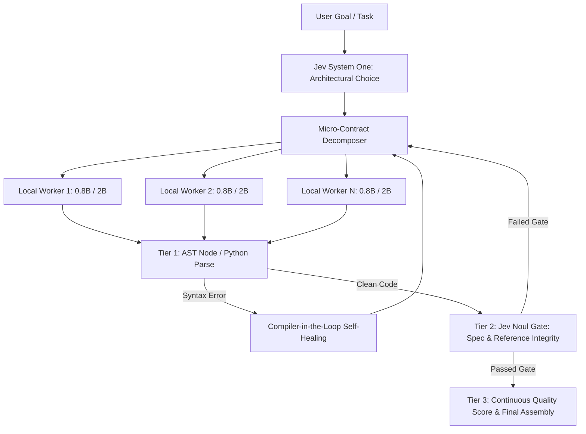

# TypeSafe AI (Jev) & Local SLM Swarm

[](https://opensource.org/licenses/MIT)
[](https://www.python.org/downloads/)
[](requirements.txt)
[]()
[](https://docs.typesafe.ai)
[-orange.svg)](https://ollama.com)

> **Empirical research, agent skills, and a domain-agnostic swarm engine coordinating sub-2B parameter local models (SLMs) under the strict supervision of TypeSafe AI's System One model (Jev).**

---

## 💡 The Core Thesis

Small Language Models (<2B parameters) run blazing fast (30–60 tokens/sec) and 100% private on consumer hardware like Apple Silicon M1. However, when assigned complex, monolithic coding tasks, they frequently suffer from:
1. **Attention Drift & Conversational Looping**: Sub-1B models omit code markdown fences and burn token budgets in reasoning loops.
2. **Out-of-Contract Scope Creep**: 2B models invent undeclared functions and collide variables across modules.
3. **Syntax Fragility**: Truncation at output limits causes unclosed blocks and parse errors.

**The Solution:** Rather than relying on massive, slow frontier models for every token, we deploy **TypeSafe Jev System One** as an ultra-fast (~650ms) architectural judge and quality gate over a swarm of agile local SLMs.



---

## 🎮 Playable Game Arcade (Community Showcase)

Every game below was synthesized locally by 0.8B and 2B parameter SLMs governed by Jev System One. Open [`benchmarks/index.html`](benchmarks/index.html) in your browser to launch the full interactive showcase!

| Game / Simulation | Worker Model | Assembly Time | Jev Gate Overhead | Playable Artifact |
| :--- | :--- | :--- | :--- | :--- |
| **Retro Space Invaders** | 4× Huihui-2B (Player, Fleet, Bullets, Renderer) | 67.4s (~28 tok/s) | 2,799 ms (4 checks) | [Play Game](benchmarks/space_invaders/space_invaders_playable.html) |
| **Flappy Pig Deluxe** | Huihui-2B (Arcade physics + Web Audio) | 27.2s | 1,548 ms (2 checks) | [Play Deluxe](benchmarks/run_2_typesafe_jev/index.html) vs [Baseline](benchmarks/run_1_baseline/index.html) |
| **3D Interactive Arena** | Three.js Procedural Physics Simulation | Instant Boot | Architectural Spec Gate | [Launch 3D Arena](benchmarks/3d_ball_simulation/index.html) |
| **6-Team Swarm Hackathon** | 6 Autonomous SLM Teams in Parallel | 4,200 tokens | Jev Multi-Audit (2.68 / 3.0) | [View Leaderboard](benchmarks/hackathon_swarm/leaderboard.html) |

---

## 📊 Empirical Benchmarks & Hardware Limits

All benchmarks were conducted on an **Apple Silicon M1 (8 cores, 16GB Unified RAM, macOS Darwin)** running Ollama locally:

### 1. Multi-Agent Concurrency (1 to 24 Concurrent Workers)

| Local Model | Parallel Agents | Total Wall-Clock | Success Rate | Throughput | Unified RAM Usage |
| :--- | :--- | :--- | :--- | :--- | :--- |
| `huihui-qwen3.5:0.8b` | 1 agent | 2.29s | 1/1 (100%) | 52.3 tok/s | 2,851 MB |
| `huihui-qwen3.5:0.8b` | 8 agents | 16.56s | 8/8 (100%) | 57.9 tok/s | 2,950 MB |
| **`huihui-qwen3.5:0.8b`** | **24 agents** | **56.06s** | **24/24 (100%)** | **51.4 tok/s** | **2,815 MB** |
| `huihui-qwen3.5:2b` | 1 agent | 3.87s | 1/1 (100%) | 31.0 tok/s | 2,790 MB |
| `huihui-qwen3.5:2b` | 8 agents | 32.90s | 8/8 (100%) | 29.2 tok/s | 2,710 MB |
| **`huihui-qwen3.5:2b`** | **24 agents** | **89.78s** | **24/24 (100%)** | **32.1 tok/s** | **2,755 MB** |

> **Key Takeaway:** Unified Memory on Apple Silicon maintains rock-solid memory stability (~2.8GB–3.0GB) even when firing 24 parallel inference threads. Throughput remains pegged at full hardware speed without thermal degradation.

### 2. The 3-Tier Verification & Self-Healing Pipeline

1. **Tier 1 (Runtime & Syntax Execution)**: Headless AST compilation (`ast.parse` in Python, `node -e "new vm.Script(...)"` in JavaScript) guaranteeing exit code `0`.
2. **Compiler-in-the-Loop Self-Healing**: Feeds syntax errors back to the model with `num_predict >= 1200` to heal missing braces, unclosed strings, or scope truncation.
3. **Tier 2 (Jev Contract Gates)**: Calibrated `Noul` checks ($P(\text{Yes}) \ge 0.70$) verifying interface compatibility and spec adherence.
4. **Tier 3 (Quality & Choice)**: Continuous maintainability scoring (`Score` [0.0–3.0]) and architectural selection (`Choice`).

Read the complete [Empirical Theoretical Limits Report](references/theoretical_limits_report.md) for full root-cause analysis and mathematical formulation.

---

## ⚡ 3-Minute Quickstart

### 1. Prerequisites
- Python 3.9+ (The CLI and Swarm engine have **zero third-party dependencies**).
- [Ollama](https://ollama.com/) installed and running.
- [TypeSafe AI API Key](https://console.typesafe.ai/keys).

### 2. Clone & Setup
```bash
git clone https://github.com/sandrovita/jev-skill.git
cd jev-skill

# Export your TypeSafe API key (or store in macOS keychain)
export TYPESAFE_API_KEY="your_typesafe_key_here"

# Run the 1-command verification & model builder
./setup.sh
```

### 3. Evaluate Code with `jev_eval.py`
Zero-dependency CLI for code evaluation, security audits, and prompt disambiguation:

```bash
# Evaluate a file against requirements
python3 scripts/jev_eval.py --file path/to/script.py --prompt "Implement LRU Cache"

# Evaluate a git diff before committing
git diff > /tmp/change.patch
python3 scripts/jev_eval.py --diff /tmp/change.patch --prompt "Fix connection pool leak"

# Pre-planning prompt disambiguation
python3 scripts/jev_eval.py --prompt "Build a real-time multiplayer card game" --mode prompt
```

### 4. Run a Micro-Contract Swarm
```python
from scripts.jev_swarm import JevSwarm

swarm = JevSwarm(default_worker_model="huihui-qwen3.5:2b")

result = swarm.execute_micro_contract(
    task_id="rate_limiter",
    prompt="Write a Python class TokenBucket with allow_request(tokens). Output ONLY the class.",
    lang="python",
    spec_requirement="Does TokenBucket properly refill tokens based on elapsed time without race conditions?",
    max_tokens=1200,
    min_noul=0.70
)

if result["passed"]:
    print(f"Quality Score: {result['quality_score']}/3.0")
    print(result["code"])
```

---

## 🤖 Installing into AI Coding Agents

### Antigravity
Add to your project's `.agents/skills/typesafe-ai/` or install globally:
```bash
mkdir -p ~/.gemini/config/skills
cp -r . ~/.gemini/config/skills/typesafe-ai
```

### OpenCode
Pre-configured for OpenCode with local Ollama providers and agent definitions:
```bash
# Launch OpenCode interactive TUI with local 2B model
opencode -m ollama/huihui-qwen3.5:2b

# Run an autonomous task
opencode run -m ollama/huihui-qwen3.5:2b "Implement a generic binary heap in Python"
```

### Claude Code
```bash
claude plugin marketplace add typesafe-ai/skills
claude plugin install typesafe@typesafe-ai
```

---

## 📁 Repository Structure

```text
.
├── SKILL.md                          # Main agent skill definition
├── AGENTS.md                         # Autonomous agent workspace & swarm guide
├── README.md                         # Project documentation & showcase
├── LICENSE                           # MIT License
├── CONTRIBUTING.md                   # Community contribution guidelines
├── setup.sh                          # 1-command verification & model setup
├── requirements.txt                  # Dependency notice (Zero required)
├── scripts/
│   ├── jev_eval.py                   # Zero-dependency evaluation CLI
│   ├── jev_swarm.py                  # Generic domain-agnostic swarm engine
│   ├── test_connection.py            # Latency & API connectivity tester
│   ├── utils.py                      # Shared API key & platform utilities
│   ├── modelfiles/                   # Hardware-optimized Ollama modelfiles
│   └── hackathon_swarm_engine.py     # Multi-team competition engine
├── benchmarks/                       # Empirical benchmarks & playable arcade
│   ├── index.html                    # Interactive Community Showcase Dashboard
│   ├── space_invaders/               # Playable Retro Space Invaders
│   ├── run_2_typesafe_jev/           # Playable Flappy Pig Deluxe
│   ├── 3d_ball_simulation/          # Three.js 3D Procedural Simulation
│   ├── hackathon_swarm/              # 6-Team autonomous hackathon outputs
│   ├── swarm_capacity_benchmark.json # Concurrency stress test data (1-24 agents)
│   └── exp4_self_healing_swarm.py    # Compiler-in-the-loop self-healing tests
└── references/
    ├── theoretical_limits_report.md  # Empirical research on SLM limits & failure modes
    ├── swarm_orchestration_guide.md  # Micro-contract design patterns
    ├── api_reference.md              # TypeSafe System One HTTP API schema
    └── primitives_guide.md           # Choice, Score, and Noul guide
```

---

## 📜 License

This project is licensed under the [MIT License](LICENSE) - see the LICENSE file for details.

Developed by Sandro Vita and Open Source Contributors. Powered by [TypeSafe AI](https://typesafe.ai).
