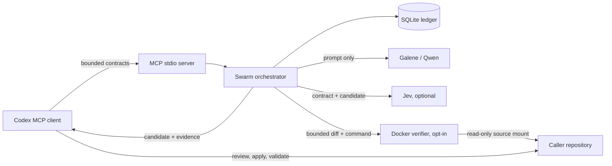

# Architecture

**Last reviewed:** 2026-09-23  
**Implementation source:** `src/codex_galene_swarm/`

## System context



The service is one Python process. MCP calls and background worker threads share
a SQLite ledger. There is no worker-side tool loop and no control channel from a
Qwen worker back into Codex.

## Components

| Component | File | Responsibility |
|---|---|---|
| MCP adapter | `server.py` | Exposes four stdio tools and builds configured dependencies |
| Contract/evidence models | `models.py` | Validates task fields and serializes provider/gate/verifier results |
| Orchestrator | `orchestrator.py` | Starts bounded thread-pool work, sequences gates, maps failures, handles cancellation |
| Galene provider | `providers.py` | Builds the bounded prompt and calls OpenAI-compatible `/chat/completions` |
| Jev evaluator | `jev.py` | Applies policy v1 thresholds to the trusted contract and untrusted candidate |
| Run store | `store.py` | Persists runs, tasks, contracts, evidence, errors, and cancellation in SQLite/WAL |
| Docker verifier | `verifier.py` | Copies repository inputs, checks/applies a diff, and runs a command in an isolated container |

## Request flow

1. `swarm_start` validates the overall goal, task count, every strict task
   contract, unique task IDs, and availability of requested gates.
2. It creates the run and queued tasks transactionally in SQLite, marks the run
   `running`, and submits each task to a bounded `ThreadPoolExecutor`.
3. A task checks cancellation, changes to `running`, and sends its prompt to
   Galene.
4. After generation it checks cancellation again. It then records the candidate
   and provider metadata in memory for the next gates.
5. Jev evaluates the result if required; otherwise an explicit `ungated` result
   is recorded.
6. A passing unified diff is verified when the contract supplies a command.
7. The final task state and available evidence are stored. When all tasks are
   terminal, the run becomes `completed` or `failed` according to the semantics
   documented in `SCOPE.md`.

## State model

Task states:

```text
queued -> running -> passed
                  -> rejected
                  -> failed
queued/running -> cancelled (cooperative)
```

Run states:

```text
queued -> running -> completed
                  -> failed
queued/running -> cancelled
```

Cancellation immediately marks the run and all still-active tasks cancelled and
attempts to cancel futures that have not started. An in-flight external request
is not interrupted. Checks after provider generation and Jev evaluation avoid
starting further gates after cancellation; a ledger guard prevents a late
provider, Jev, or verifier result from replacing a cancelled task.

## Persistence and restart behavior

SQLite is the durable evidence ledger, not a durable job queue. It stores the
contract before dispatch and uses WAL mode with database files restricted to
mode `0600`. Candidate text and verifier output are stored; provider secrets are
not.

Background work lives only in the server process. After an unexpected restart,
previously `queued` or `running` tasks in active runs are marked failed with an
interruption error, and their runs become failed. Work is not resumed. Operating
more than one server process against the same database is outside the current
design.

The in-memory future registry is process-local and completed futures are pruned.

## Provider boundary

The Galene adapter sends a system message plus one generated user prompt. It
uses low temperature, requests Qwen's supported `low` reasoning effort, sends
both top-level and chat-template `enable_thinking=false`, does not stream, and
supplies the per-contract token ceiling. A live 2026-09-23 Galene probe showed
zero reasoning tokens only after the top-level setting was added; the actual
response metadata remains the evidence for each request.

Repository content reaches a worker only through fields Codex places in the
contract. The prompt labels `context` as untrusted data, but prompt wording is a
defense-in-depth control, not a data-loss-prevention boundary. Codex must avoid
including secrets or unrelated source.

An empty completion is a provider failure. Safe metadata such as request ID,
finish reason, and token counts is retained when available so token exhaustion
can be distinguished from a generic failure.

## Jev gate

Policy version 1 passes only when all of these conditions hold:

| Signal | Threshold |
|---|---:|
| Reference integrity | >= 0.70 |
| Specification compliance | >= 0.70 |
| No scope creep | >= 0.70 |
| Code quality | >= 1.0 / 3.0 |

The full trusted contract and candidate are evaluated. The candidate is clearly
delimited as untrusted. A malformed response or network error fails the task;
there is no permissive fallback when Jev was required.

## Executable verifier boundary

The verified profile is intentionally separate because mounting the Docker
socket grants control of the host Docker daemon. Once explicitly enabled:

1. The service inventories tracked and unignored untracked repository files.
2. It copies them to a temporary directory; ignored files such as `.env` are
   excluded by Git inventory rules.
3. It asks `git apply --numstat` which paths the diff changes, validates safe
   relative paths, and rejects anything outside `allowed_files`.
4. It checks and applies the patch to the copy, never the source mount.
5. It stages that copy into an ephemeral snapshot and runs the supplied argument
   vector in a second container as UID/GID 65534 with no network, no Linux
   capabilities, `no-new-privileges`, bounded CPU/memory/PIDs, a read-only root,
   and writable in-memory `/workspace` and `/tmp`.
6. It retains at most the final 32,000 output characters and removes containers
   and the temporary snapshot image.

The verifier image is selected by the operator, not the worker. It must already
exist and contain the requested test runtime. The configured timeout currently
bounds verifier setup/container lifetime configuration but does not enforce a
hard deadline on Docker SDK `exec_run`; hard timeout enforcement is an open
engineering gap.

## Configuration

| Variable | Required | Default | Used by |
|---|---:|---|---|
| `GALENE_API_KEY` | yes | none | Provider |
| `GALENE_BASE_URL` | yes | empty | Provider |
| `GALENE_MODEL` | no | `Galene/LLM` | Provider |
| `GALENE_TIMEOUT_SECONDS` | no | `180` | Local request timeout; `0` disables it for a research run |
| `TYPESAFE_API_KEY` | only for required Jev | none | Jev |
| `TYPESAFE_URL` | no | TypeSafe System One endpoint | Jev |
| `SWARM_DB_PATH` | no | `/data/swarm.sqlite3` | Store |
| `SWARM_MAX_CONCURRENCY` | no | `4` | Operator-selected positive worker count; no fixed product maximum |
| `SWARM_REQUIRE_JEV` | no | `0` | MCP adapter; `1` requires Jev for every run |
| `SWARM_REPOSITORY_PATH` | only for verification | none | Verifier |
| `SWARM_VERIFIER_IMAGE` | only for verification | profile image | Verifier |
| `SWARM_VERIFIER_TIMEOUT` | no | `300` seconds | Verifier; valid 1-1800 |

## Architectural constraints for future work

- Preserve a provider interface so deterministic fakes remain sufficient for
  most orchestration tests.
- Keep gate evidence structured and policy versions explicit.
- Do not let transport concerns bypass contract validation or orchestration.
- Do not give workers repository or tool access to make a feature easier.
- Treat durable recovery, multi-process coordination, remote transports, and
  automatic application as separate design changes requiring explicit scope and
  security decisions.
